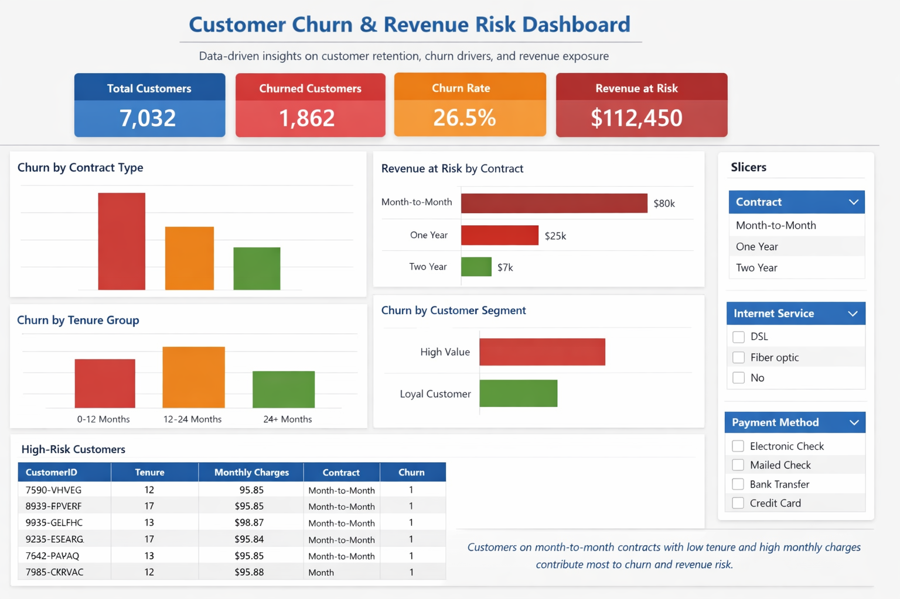
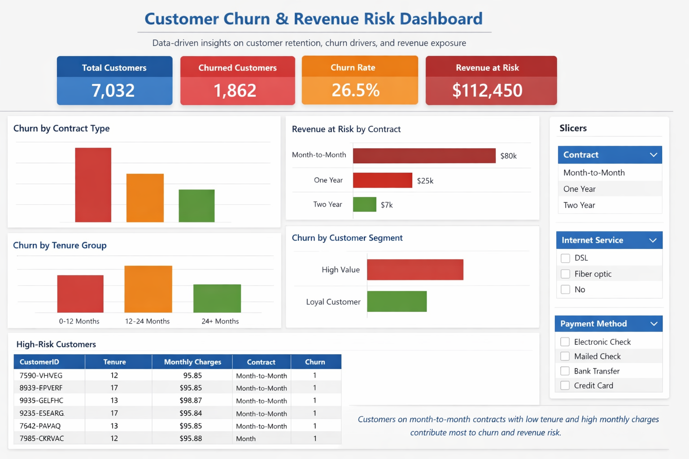

# 🎯 Customer Churn Prediction System (End-to-End Analytics)

## 📊 Python, Machine Learning & Power BI Analytics Project

---

## 🪄 Introduction

This project delivers a complete **end-to-end churn prediction system**, transforming messy customer data into actionable insights, predictive models, and executive dashboards.

It simulates a real-world **subscription / financial services scenario**, demonstrating how analytics can:

- Predict customer churn
- Identify revenue risk
- Enable proactive retention strategies
- Support executive decision-making

---

## 📊 Badges


---

## 🧭 Business Context

Customer churn directly impacts **revenue, growth, and customer lifetime value (CLV)**.

Organizations must:

- Detect churn risk early
- Understand why customers leave
- Protect high-value segments
- Optimize retention strategies

This project demonstrates how data can be leveraged to **move from reactive to proactive decision-making**.

---

## 🎯 Purpose of the Project

To build a **scalable analytics system** that:

- Predicts churn probability
- Identifies key churn drivers
- Quantifies **Revenue at Risk**
- Segments customers for targeted retention
- Provides a **Power BI dashboard for executives**

---

## 📈 Expected Outcomes

- Predictive churn model (Machine Learning)
- Business-ready KPIs and metrics
- Insight-driven dashboard
- Data pipeline (clean → transform → model)
- Portfolio-ready project demonstrating real-world skills

---

## ⚠️ Disclaimer

This dataset is used strictly for:

- Learning
- Portfolio demonstration

It does not represent real customer data.

---

## 📑 Table of Contents

- [Project Overview](#-project-overview)
- [Dataset Description](#-dataset-description)
- [Data Pipeline](#-data-pipeline)
- [Machine Learning Model](#-machine-learning-model)
- [Power BI Dashboard](#-power-bi-dashboard)
- [Key KPIs](#-key-kpis)
- [Key Insights](#-key-insights)
- [Strategic Recommendations](#-strategic-recommendations)
- [Tools & Technologies](#-tools--technologies)
- [Conclusion](#-conclusion)
- [Author](#-author)

---

## 🧭 Project Overview

This project demonstrates how raw customer data can be transformed into:

- Predictive intelligence
- Business insights
- Executive dashboards

The focus is on **business impact, not just model accuracy**.

---

## 🗂️ Dataset Description

The dataset includes:

- Customer demographics
- Account details
- Service usage
- Financial data
- Churn status

---

## 📄 Data Sources

### 🔹 Raw Data
👉 [messy_churn.csv](data/raw/messy_churn.csv)

### 🔹 Processed Data
- 👉 [cleaned_churn.csv](data/processed/cleaned_churn.csv)  
- 👉 [featured_churn.csv](data/processed/featured_churn.csv)  
- 👉 [feature_importance.csv](data/processed/feature_importance.csv)

---

## ⚙️ Data Pipeline

### 🔹 Data Cleaning
- Removed duplicates
- Handled missing values
- Fixed inconsistent categories
- Created:
  - `has_internet`
  - `has_phone`

---

### 🔹 Feature Engineering
- Customer Lifetime Value (CLV)
- Average Revenue
- High Value Customers
- Loyal Customers

---

### 🔹 Model Training
- Random Forest Classifier
- Feature importance extraction
- Model saved for reuse (`model.pkl`)

---

## 🤖 Machine Learning Model

The model predicts churn and identifies key drivers such as:

- Contract type
- Tenure
- Monthly charges
- Customer segmentation

---

## 📊 Power BI Dashboard

### 🖥️ Dashboard Overview

#### 📸 Dashboard View 1


#### 📸 Dashboard View 2


---

### Dashboard Features

- KPI Cards:
  - Total Customers
  - Churn Rate
  - Revenue at Risk
- Churn Analysis:
  - Contract Type
  - Tenure Groups
- Customer Segmentation
- High-Risk Customers Table
- Interactive Filters

---

## 📌 Key KPIs

- Churn Rate
- Revenue at Risk
- Customer Lifetime Value (CLV)
- Average Monthly Charges
- Customer Segmentation Metrics

---

## 💡 Key Insights

- Month-to-month contracts have the highest churn
- Low-tenure customers are most at risk
- High-value but non-loyal customers drive revenue loss
- Service usage patterns influence retention

---

## 🧠 Strategic Recommendations

1. Target high-value, low-tenure customers  
2. Promote long-term contracts  
3. Improve onboarding experience  
4. Personalize retention strategies  
5. Monitor churn drivers continuously  

---

## 🧰 Tools & Technologies

- Python (Pandas, NumPy, Scikit-learn)
- Power BI
- SQL (conceptual)
- VS Code / Jupyter
- Git & GitHub

---

## 🏁 Conclusion

This project demonstrates how combining:

- Data Engineering
- Machine Learning
- Business Intelligence

can create a powerful system for predicting churn and enabling **data-driven decision-making**.

---

## 📁 Project Structure

```text
churn_prediction_project/
│
├── data/
│   ├── raw/
│   │   └── messy_churn.csv
│   ├── processed/
│       ├── cleaned_churn.csv
│       ├── featured_churn.csv
│       ├── feature_importance.csv
│
├── src/
│   ├── data_cleaning.py
│   ├── feature_engineering.py
│   ├── train_model.py
│
├── dashboard/
│   ├── dashboard_1.png
│   ├── dashboard_2.png
│   └── churn_dashboard.pbix
│
├── model.pkl
└── README.md